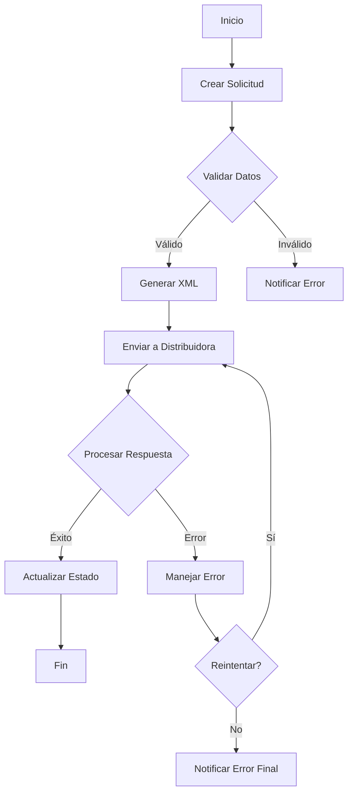
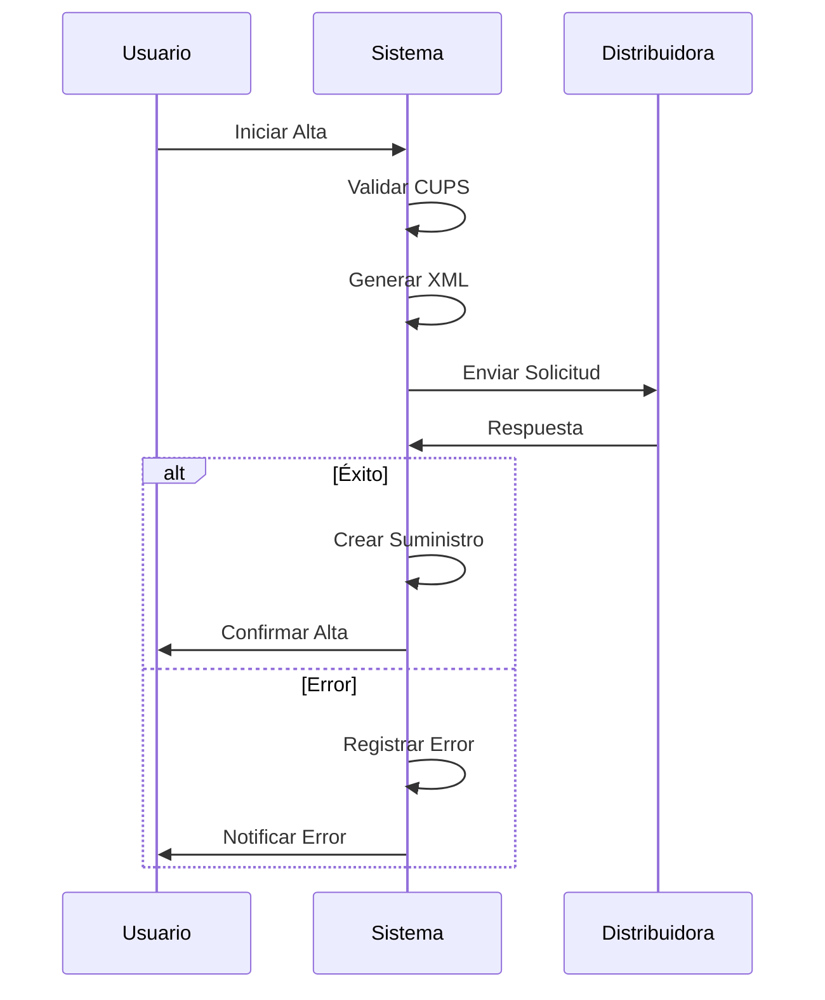
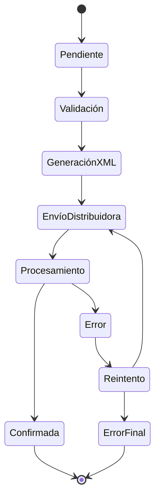
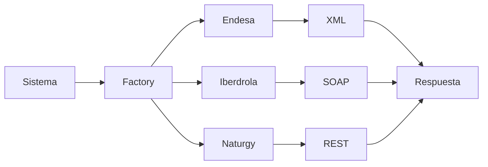
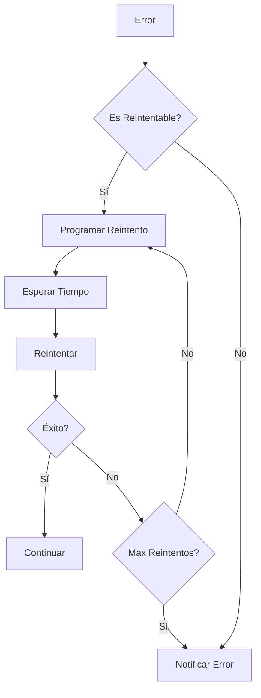

# Switching - Sistema de Cambio de Comercializadora

## Descripción
Sistema de cambio de comercializadora para el mercado energético español. Permite gestionar los procesos de alta, baja y cambio de comercializadora para suministros de electricidad y gas natural.

## Estructura del Proyecto

### Objetos Personalizados

#### Service__c
Objeto principal que representa un suministro energético.
- **Campos principales**:
  - `AccountId__c`: Referencia a la cuenta
  - `CUPS__c`: Código Universal del Punto de Suministro
  - `CUPS_Electricidad__c`: CUPS específico para electricidad
  - `CUPS_Gas__c`: CUPS específico para gas
  - `Contract__c`: Referencia al contrato
  - `Country__c`: País del suministro
  - `Distributor__c`: Distribuidora
  - `Effective_Date__c`: Fecha efectiva del cambio
  - `Energy_Type__c`: Tipo de energía (Electricidad/Gas)
  - `Holder_NIF__c`: NIF del titular
  - `Holder_Name__c`: Nombre del titular
  - `New_Holder_NIF__c`: NIF del nuevo titular
  - `New_Holder_Name__c`: Nombre del nuevo titular
  - `New_Supplier__c`: Nueva comercializadora
  - `Status__c`: Estado del suministro
  - `Type__c`: Tipo de proceso

#### Switching_Request__c
Gestiona las solicitudes de cambio.
- **Campos principales**:
  - `CUPS__c`: Código CUPS
  - `Configuration__c`: Configuración asociada
  - `Contract__c`: Contrato relacionado
  - `Country__c`: País
  - `Distributor__c`: Distribuidora
  - `Effective_Date__c`: Fecha efectiva
  - `Process_Type__c`: Tipo de proceso
  - `Request_Date__c`: Fecha de solicitud
  - `Response_Date__c`: Fecha de respuesta
  - `Status__c`: Estado de la solicitud
  - `Type__c`: Tipo de solicitud

#### Switching_Message__c
Registra los mensajes intercambiados con las distribuidoras.
- **Campos principales**:
  - `Account__c`: Cuenta asociada
  - `CUPS__c`: Código CUPS
  - `Distributor__c`: Distribuidora
  - `Message_Content__c`: Contenido del mensaje
  - `Message_Type__c`: Tipo de mensaje
  - `Request_XML__c`: XML de solicitud
  - `Response_XML__c`: XML de respuesta
  - `Status__c`: Estado del mensaje

#### Switching_Configuration__c
Configuración de integración con distribuidoras.
- **Campos principales**:
  - `API_Key__c`: Clave API
  - `Active__c`: Estado activo
  - `Country__c`: País
  - `Distributor__c`: Distribuidora
  - `Endpoint_URL__c`: URL del endpoint
  - `Integration_Class__c`: Clase de integración
  - `Message_Format__c`: Formato de mensaje
  - `Process_Type__c`: Tipo de proceso
  - `Template__c`: Plantilla

#### XML_Template__c
Plantillas XML para las comunicaciones.
- **Campos principales**:
  - `Active__c`: Estado activo
  - `CodigoProceso__c`: Código de proceso
  - `Country__c`: País
  - `Distributor__c`: Distribuidora
  - `Process_Type__c`: Tipo de proceso
  - `Template_Body__c`: Cuerpo de la plantilla
  - `Template_Content__c`: Contenido de la plantilla
  - `Version__c`: Versión

### Clases Apex

#### Clases Base
- `BaseDistributorIntegration`: Clase base para integraciones
- `BaseSwitchingProcess`: Clase base para procesos de cambio
- `IDistributorIntegration`: Interfaz para integraciones

#### Procesos de Cambio
- `ElecAltaProcess`: Proceso de alta eléctrica
- `ElecBajaProcess`: Proceso de baja eléctrica
- `ElecCambioComercializadoraProcess`: Cambio de comercializadora eléctrica
- `ElecCambioTitularProcess`: Cambio de titular eléctrico
- `GasBajaProcess`: Proceso de baja de gas
- `GasCambioComercializadoraProcess`: Cambio de comercializadora de gas
- `GasCambioTitularProcess`: Cambio de titular de gas

#### Integraciones
- `EndesaIntegration`: Integración con Endesa
- `IberdrolaIntegration`: Integración con Iberdrola
- `NaturgyIntegration`: Integración con Naturgy

#### Utilidades
- `MessageGenerator`: Generador de mensajes
- `SwitchingErrorHandler`: Manejador de errores
- `SwitchingEventHandler`: Manejador de eventos
- `SwitchingRetryHandler`: Manejador de reintentos
- `SwitchingRetryScheduler`: Programador de reintentos
- `XMLTemplateManager`: Gestor de plantillas XML

### Flows
- `Process_Switching_Request`: Flow principal para procesar solicitudes

### Permission Sets
- `Switching_Admin`: Permisos de administración

## Procesos Implementados

### 1. Alta de Suministro Eléctrico
- Validación de datos del CUPS
- Generación de solicitud XML
- Envío a distribuidora
- Procesamiento de respuesta

### 2. Baja de Suministro
- Verificación de titularidad
- Generación de solicitud
- Confirmación de baja
- Actualización de estado

### 3. Cambio de Comercializadora
- Validación de condiciones
- Generación de solicitud
- Comunicación con distribuidora
- Confirmación del cambio

### 4. Cambio de Titular
- Verificación de documentación
- Generación de solicitud
- Procesamiento de respuesta
- Actualización de datos

## Diagramas de Procesos

### Flujo General del Sistema

### Proceso de Alta

### Proceso de Baja

### Integración con Distribuidoras

### Manejo de Errores

## Integración con Distribuidoras

### Endesa
- Endpoint específico
- Formato XML personalizado
- Manejo de autenticación

### Iberdrola
- Protocolo SOAP
- Validación de certificados
- Gestión de errores

### Naturgy
- API REST
- Autenticación OAuth
- Formato JSON

## Manejo de Errores
- Sistema de reintentos automático
- Notificaciones de error
- Registro detallado de fallos
- Recuperación de procesos

## Seguridad
- Permisos por perfil
- Validación de datos
- Encriptación de información sensible
- Registro de auditoría

## Próximos Pasos
1. Implementar integración con más distribuidoras
2. Mejorar sistema de reintentos
3. Optimizar procesamiento de XML
4. Añadir más tipos de procesos
5. Implementar notificaciones push

## Contacto
Para soporte técnico o consultas, contactar con el equipo de desarrollo. 