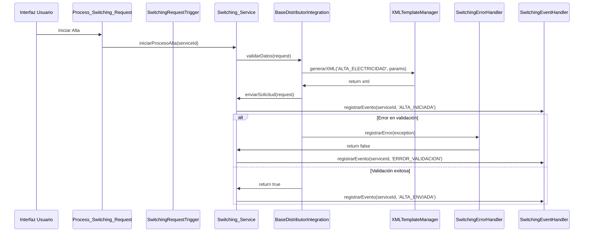
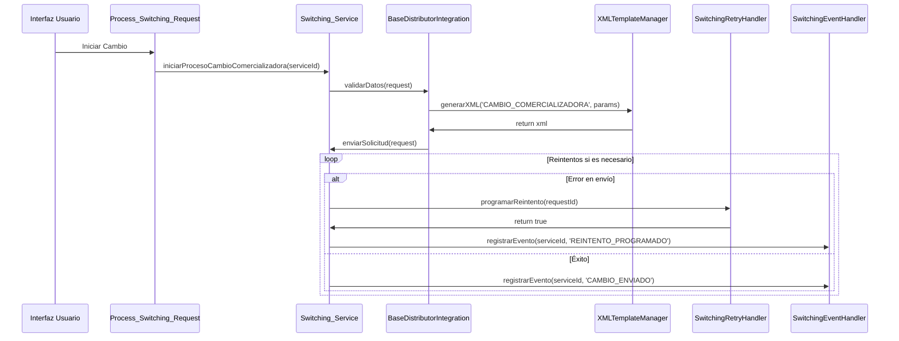

# Switching - Sistema de Cambio de Comercializadora

## Descripción
Sistema de cambio de comercializadora para el mercado energético español. Permite gestionar los procesos de alta, baja y cambio de comercializadora para suministros de electricidad y gas natural.

## Funcionalidad Detallada

### Gestión de Suministros
El sistema permite gestionar todo el ciclo de vida de un suministro energético:
- **Registro de Suministros**: Creación y mantenimiento de suministros eléctricos y de gas
- **Validación de CUPS**: Verificación automática de la validez de los códigos CUPS
- **Gestión de Titularidad**: Control de cambios de titular y actualización de datos
- **Seguimiento de Estados**: Monitoreo del estado de cada suministro en tiempo real

### Procesos de Cambio
El sistema automatiza los siguientes procesos:

#### 1. Alta de Suministro
- Validación de datos del punto de suministro
- Verificación de disponibilidad del CUPS
- Generación de solicitud de alta
- Comunicación con la distribuidora
- Procesamiento de la respuesta
- Actualización del estado del suministro

#### 2. Baja de Suministro
- Verificación de titularidad actual
- Validación de condiciones para la baja
- Generación de solicitud de baja
- Confirmación con la distribuidora
- Actualización del estado final

#### 3. Cambio de Comercializadora
- Validación de condiciones del contrato actual
- Verificación de fechas de cambio
- Generación de solicitud de cambio
- Comunicación con ambas comercializadoras
- Confirmación del cambio efectivo

#### 4. Cambio de Titular
- Validación de documentación del nuevo titular
- Verificación de requisitos legales
- Generación de solicitud de cambio
- Procesamiento de la respuesta
- Actualización de datos del titular

### Integración con Distribuidoras
El sistema se comunica con las principales distribuidoras del mercado español:

#### Endesa
- Integración mediante API REST
- Autenticación mediante tokens
- Formato de mensajes XML personalizado
- Manejo específico de errores y validaciones

#### Iberdrola
- Comunicación mediante protocolo SOAP
- Validación de certificados digitales
- Formato de mensajes estandarizado
- Sistema de confirmaciones en dos pasos

#### Naturgy
- API REST con autenticación OAuth
- Formato de mensajes JSON
- Sistema de notificaciones push
- Manejo de estados intermedios

### Sistema de Notificaciones
- Notificaciones automáticas por email
- Alertas de estado en tiempo real
- Registro detallado de eventos
- Sistema de notificaciones push para cambios críticos

### Manejo de Errores
- Sistema de reintentos automático
- Registro detallado de errores
- Clasificación de errores por tipo
- Notificaciones de error personalizadas
- Recuperación automática de procesos

### Reportes y Analytics
- Dashboard de seguimiento
- Reportes de actividad
- Análisis de tiempos de proceso
- Métricas de éxito/fracaso
- Predicción de tiempos de respuesta

## Estructura del Proyecto

### Objetos Personalizados

#### Service__c
Objeto principal que representa un suministro energético.
- **Campos principales**:
  - `AccountId__c`: Referencia a la cuenta
  - `CUPS__c`: Código Universal del Punto de Suministro
  - `CUPS_Electricidad__c`: CUPS específico para electricidad
  - `CUPS_Gas__c`: CUPS específico para gas
  - `Contract__c`: Referencia al contrato
  - `Country__c`: País del suministro
  - `Distributor__c`: Distribuidora
  - `Effective_Date__c`: Fecha efectiva del cambio
  - `Energy_Type__c`: Tipo de energía (Electricidad/Gas)
  - `Holder_NIF__c`: NIF del titular
  - `Holder_Name__c`: Nombre del titular
  - `New_Holder_NIF__c`: NIF del nuevo titular
  - `New_Holder_Name__c`: Nombre del nuevo titular
  - `New_Supplier__c`: Nueva comercializadora
  - `Status__c`: Estado del suministro
  - `Type__c`: Tipo de proceso

#### Switching_Request__c
Gestiona las solicitudes de cambio.
- **Campos principales**:
  - `CUPS__c`: Código CUPS
  - `Configuration__c`: Configuración asociada
  - `Contract__c`: Contrato relacionado
  - `Country__c`: País
  - `Distributor__c`: Distribuidora
  - `Effective_Date__c`: Fecha efectiva
  - `Process_Type__c`: Tipo de proceso
  - `Request_Date__c`: Fecha de solicitud
  - `Response_Date__c`: Fecha de respuesta
  - `Status__c`: Estado de la solicitud
  - `Type__c`: Tipo de solicitud

#### Switching_Message__c
Registra los mensajes intercambiados con las distribuidoras.
- **Campos principales**:
  - `Account__c`: Cuenta asociada
  - `CUPS__c`: Código CUPS
  - `Distributor__c`: Distribuidora
  - `Message_Content__c`: Contenido del mensaje
  - `Message_Type__c`: Tipo de mensaje
  - `Request_XML__c`: XML de solicitud
  - `Response_XML__c`: XML de respuesta
  - `Status__c`: Estado del mensaje

#### Switching_Configuration__c
Configuración de integración con distribuidoras.
- **Campos principales**:
  - `API_Key__c`: Clave API
  - `Active__c`: Estado activo
  - `Country__c`: País
  - `Distributor__c`: Distribuidora
  - `Endpoint_URL__c`: URL del endpoint
  - `Integration_Class__c`: Clase de integración
  - `Message_Format__c`: Formato de mensaje
  - `Process_Type__c`: Tipo de proceso
  - `Template__c`: Plantilla

#### XML_Template__c
Plantillas XML para las comunicaciones.
- **Campos principales**:
  - `Active__c`: Estado activo
  - `CodigoProceso__c`: Código de proceso
  - `Country__c`: País
  - `Distributor__c`: Distribuidora
  - `Process_Type__c`: Tipo de proceso
  - `Template_Body__c`: Cuerpo de la plantilla
  - `Template_Content__c`: Contenido de la plantilla
  - `Version__c`: Versión

### Clases Apex

#### Clases Base
- `BaseDistributorIntegration`: Clase base para integraciones
- `BaseSwitchingProcess`: Clase base para procesos de cambio
- `IDistributorIntegration`: Interfaz para integraciones

#### Procesos de Cambio
- `ElecAltaProcess`: Proceso de alta eléctrica
- `ElecBajaProcess`: Proceso de baja eléctrica
- `ElecCambioComercializadoraProcess`: Cambio de comercializadora eléctrica
- `ElecCambioTitularProcess`: Cambio de titular eléctrico
- `GasBajaProcess`: Proceso de baja de gas
- `GasCambioComercializadoraProcess`: Cambio de comercializadora de gas
- `GasCambioTitularProcess`: Cambio de titular de gas

#### Integraciones
- `EndesaIntegration`: Integración con Endesa
- `IberdrolaIntegration`: Integración con Iberdrola
- `NaturgyIntegration`: Integración con Naturgy

#### Utilidades
- `MessageGenerator`: Generador de mensajes
- `SwitchingErrorHandler`: Manejador de errores
- `SwitchingEventHandler`: Manejador de eventos
- `SwitchingRetryHandler`: Manejador de reintentos
- `SwitchingRetryScheduler`: Programador de reintentos
- `XMLTemplateManager`: Gestor de plantillas XML

### Métodos Principales

#### Switching_Service
Clase principal que orquesta los procesos de switching.

```apex
// Métodos principales
public static void iniciarProcesoAlta(Id serviceId)
public static void iniciarProcesoBaja(Id serviceId)
public static void iniciarProcesoCambioComercializadora(Id serviceId)
public static void iniciarProcesoCambioTitular(Id serviceId)
public static void procesarSolicitud(Id requestId)
public static void actualizarEstado(Id serviceId, String nuevoEstado)
```

#### BaseDistributorIntegration
Clase base para las integraciones con distribuidoras.

```apex
// Métodos principales
public virtual void enviarSolicitud(Switching_Request__c request)
public virtual void procesarRespuesta(Switching_Message__c message)
public virtual void validarDatos(Switching_Request__c request)
public virtual void manejarError(Switching_Message__c message)
```

#### SwitchingErrorHandler
Manejador de errores del sistema.

```apex
// Métodos principales
public static void registrarError(Exception e)
public static Boolean esReintentable(Exception e)
public static void notificarError(Id requestId, String mensaje)
public static void clasificarError(Exception e)
```

#### XMLTemplateManager
Gestor de plantillas XML.

```apex
// Métodos principales
public static String generarXML(String templateName, Map<String, Object> params)
public static void validarXML(String xml)
public static String procesarRespuestaXML(String xml)
public static void guardarPlantilla(XML_Template__c template)
```

#### SwitchingRetryHandler
Manejador de reintentos.

```apex
// Métodos principales
public static void programarReintento(Id requestId)
public static void ejecutarReintento(Id requestId)
public static Integer obtenerNumeroReintentos(Id requestId)
public static void cancelarReintentos(Id requestId)
```

#### MessageGenerator
Generador de mensajes para las distribuidoras.

```apex
// Métodos principales
public static Switching_Message__c crearMensaje(Id requestId, String tipo)
public static void actualizarMensaje(Switching_Message__c message)
public static void procesarRespuesta(Switching_Message__c message)
public static void registrarError(Switching_Message__c message, String error)
```

#### SwitchingEventHandler
Manejador de eventos del sistema.

```apex
// Métodos principales
public static void registrarEvento(Id serviceId, String tipo, String mensaje)
public static void notificarCambioEstado(Id serviceId, String estadoAnterior, String estadoNuevo)
public static void registrarComunicacion(Id messageId, String tipo)
```

### Diagrama de Clases


### Triggers y Flows

#### Triggers

##### SwitchingRequestTrigger
Trigger principal que maneja los eventos de las solicitudes de cambio.
- **Eventos manejados**:
  - `after insert`: Procesa nuevas solicitudes
  - `after update`: Maneja cambios de estado en solicitudes existentes
- **Funcionalidad**:
  - Inicia el proceso de switching cuando se crea una nueva solicitud
  - Actualiza el estado del suministro cuando cambia el estado de la solicitud
  - Genera notificaciones de cambio de estado
  - Registra eventos en el historial de mensajes

##### SwitchingMessageTrigger
Maneja los eventos relacionados con los mensajes intercambiados con las distribuidoras.
- **Eventos manejados**:
  - `after insert`: Procesa nuevos mensajes
  - `after update`: Actualiza el estado de los mensajes
- **Funcionalidad**:
  - Actualiza el estado de las solicitudes relacionadas
  - Genera notificaciones de recepción de mensajes
  - Registra eventos de comunicación

#### Flows

##### Process_Switching_Request
Flow principal que orquesta el proceso de switching.
- **Elementos principales**:
  - **Screen**: Interfaz de usuario para iniciar el proceso
  - **Decision**: Valida los datos de entrada
  - **Assignment**: Asigna valores a variables
  - **Subflow**: Llama a procesos específicos
  - **Action**: Ejecuta acciones en el sistema
- **Funcionalidad**:
  - Recoge datos del usuario
  - Valida la información proporcionada
  - Determina el tipo de proceso a ejecutar
  - Inicia el proceso correspondiente
  - Maneja errores y excepciones
  - Proporciona feedback al usuario

##### Switching_Notification_Flow
Maneja las notificaciones del sistema.
- **Elementos principales**:
  - **Decision**: Determina el tipo de notificación
  - **Action**: Envía emails o notificaciones
  - **Assignment**: Prepara el contenido de las notificaciones
- **Funcionalidad**:
  - Genera notificaciones de estado
  - Envía alertas de error
  - Proporciona confirmaciones de acción
  - Mantiene un registro de notificaciones enviadas

##### Switching_Error_Handler_Flow
Maneja los errores del sistema.
- **Elementos principales**:
  - **Decision**: Clasifica el tipo de error
  - **Action**: Ejecuta acciones de recuperación
  - **Assignment**: Prepara información de error
- **Funcionalidad**:
  - Clasifica errores por tipo
  - Determina si el error es reintentable
  - Inicia procesos de recuperación
  - Notifica a los usuarios afectados
  - Registra información de error para análisis

### Permission Sets
- `Switching_Admin`: Permisos de administración

## Procesos Implementados

### 1. Alta de Suministro Eléctrico
- Validación de datos del CUPS
- Generación de solicitud XML
- Envío a distribuidora
- Procesamiento de respuesta

### 2. Baja de Suministro
- Verificación de titularidad
- Generación de solicitud
- Confirmación de baja
- Actualización de estado

### 3. Cambio de Comercializadora
- Validación de condiciones
- Generación de solicitud
- Comunicación con distribuidora
- Confirmación del cambio

### 4. Cambio de Titular
- Verificación de documentación
- Generación de solicitud
- Procesamiento de respuesta
- Actualización de datos

## Diagramas de Procesos

### Flujo General del Sistema


### Proceso de Alta


### Proceso de Baja


### Integración con Distribuidoras


### Manejo de Errores


## Diagramas Técnicos

#### Arquitectura del Sistema


#### Flujo de Datos en Alta de Suministro


#### Interacción de Triggers


#### Flows y sus Componentes


#### Manejo de Errores


#### Integración con Distribuidoras


## Diagramas de Llamadas a Métodos

#### Proceso de Alta de Suministro


#### Proceso de Cambio de Comercializadora


#### Manejo de Errores y Reintentos


#### Proceso de Notificaciones


#### Integración con Distribuidora


## Integración con Distribuidoras

### Endesa
- Endpoint específico
- Formato XML personalizado
- Manejo de autenticación

### Iberdrola
- Protocolo SOAP
- Validación de certificados
- Gestión de errores

### Naturgy
- API REST
- Autenticación OAuth
- Formato JSON

## Manejo de Errores
- Sistema de reintentos automático
- Notificaciones de error
- Registro detallado de fallos
- Recuperación de procesos

## Seguridad
- Permisos por perfil
- Validación de datos
- Encriptación de información sensible
- Registro de auditoría

## Próximos Pasos
1. Implementar integración con más distribuidoras
2. Mejorar sistema de reintentos
3. Optimizar procesamiento de XML
4. Añadir más tipos de procesos
5. Implementar notificaciones push

## Contacto
Para soporte técnico o consultas, contactar con el equipo de desarrollo.

## Ejemplos Prácticos

### 1. Alta de Suministro Eléctrico
```apex
// Crear un nuevo suministro eléctrico
Service__c nuevoSuministro = new Service__c(
    Name = 'ES1234000000000000JN',
    CUPS__c = 'ES1234000000000000JN',
    Energy_Type__c = 'Electricidad',
    Distributor__c = 'Endesa',
    Holder_NIF__c = '12345678A',
    Holder_Name__c = 'Juan Pérez',
    Effective_Date__c = Date.today().addDays(15),
    Status__c = 'Pendiente'
);
insert nuevoSuministro;

// Iniciar el proceso de alta
Switching_Service.iniciarProcesoAlta(nuevoSuministro.Id);
```

### 2. Cambio de Comercializadora
```apex
// Obtener el suministro existente
Service__c suministro = [SELECT Id, CUPS__c, Distributor__c 
                        FROM Service__c 
                        WHERE CUPS__c = 'ES1234000000000000JN' 
                        LIMIT 1];

// Actualizar con la nueva comercializadora
suministro.New_Supplier__c = 'Nueva Comercializadora';
suministro.Effective_Date__c = Date.today().addDays(30);
update suministro;

// Iniciar el proceso de cambio
Switching_Service.iniciarProcesoCambioComercializadora(suministro.Id);
```

### 3. Cambio de Titular
```apex
// Preparar datos del nuevo titular
Service__c suministro = [SELECT Id FROM Service__c 
                        WHERE CUPS__c = 'ES1234000000000000JN' 
                        LIMIT 1];

suministro.New_Holder_NIF__c = '87654321B';
suministro.New_Holder_Name__c = 'María García';
update suministro;

// Iniciar el proceso de cambio de titular
Switching_Service.iniciarProcesoCambioTitular(suministro.Id);
```

### 4. Consulta de Estado
```apex
// Obtener el estado actual de una solicitud
Switching_Request__c solicitud = [SELECT Id, Status__c, Error_Message__c 
                                FROM Switching_Request__c 
                                WHERE Service__c = :suministro.Id 
                                ORDER BY CreatedDate DESC 
                                LIMIT 1];

System.debug('Estado actual: ' + solicitud.Status__c);
if (solicitud.Error_Message__c != null) {
    System.debug('Error: ' + solicitud.Error_Message__c);
}
```

### 5. Configuración de Integración
```apex
// Configurar integración con Endesa
Switching_Configuration__c configEndesa = new Switching_Configuration__c(
    Name = 'Endesa_Config',
    Distributor__c = 'Endesa',
    Active__c = true,
    Endpoint_URL__c = 'https://api.endesa.com/v1/switching',
    API_Key__c = 'tu-api-key',
    Integration_Class__c = 'EndesaIntegration',
    Message_Format__c = 'XML',
    Timeout__c = 30
);
insert configEndesa;
```

### 6. Plantilla XML Personalizada
```apex
// Crear una plantilla XML para alta eléctrica
XML_Template__c plantilla = new XML_Template__c(
    Name = 'Alta_Electrica_Endesa',
    Distributor__c = 'Endesa',
    Process_Type__c = 'ALTA_ELECTRICIDAD',
    Active__c = true,
    Template_Body__c = '<?xml version="1.0"?><solicitud><cups>{CUPS}</cups><titular><nif>{NIF}</nif><nombre>{NOMBRE}</nombre></titular></solicitud>',
    Version__c = '1.0'
);
insert plantilla;
```

### 7. Manejo de Errores
```apex
try {
    Switching_Service.procesarSolicitud(solicitudId);
} catch (SwitchingException e) {
    // Registrar el error
    SwitchingErrorHandler.registrarError(e);
    
    // Notificar al usuario
    SwitchingNotification.notificarError(
        solicitudId,
        'Error en el proceso de switching: ' + e.getMessage()
    );
    
    // Programar reintento si es posible
    if (SwitchingRetryHandler.esReintentable(e)) {
        SwitchingRetryScheduler.programarReintento(solicitudId);
    }
}
```

### 8. Consulta de Historial
```apex
// Obtener historial de mensajes para un suministro
List<Switching_Message__c> historial = [
    SELECT Id, Message_Type__c, Status__c, Timestamp__c, 
           Request_XML__c, Response_XML__c 
    FROM Switching_Message__c 
    WHERE Service__c = :suministro.Id 
    ORDER BY Timestamp__c DESC
];

for (Switching_Message__c msg : historial) {
    System.debug('Mensaje: ' + msg.Message_Type__c);
    System.debug('Estado: ' + msg.Status__c);
    System.debug('Timestamp: ' + msg.Timestamp__c);
}
```

Estos ejemplos muestran cómo utilizar las principales funcionalidades del sistema. Para más información sobre cada método o clase, consulta la documentación específica de cada componente. 