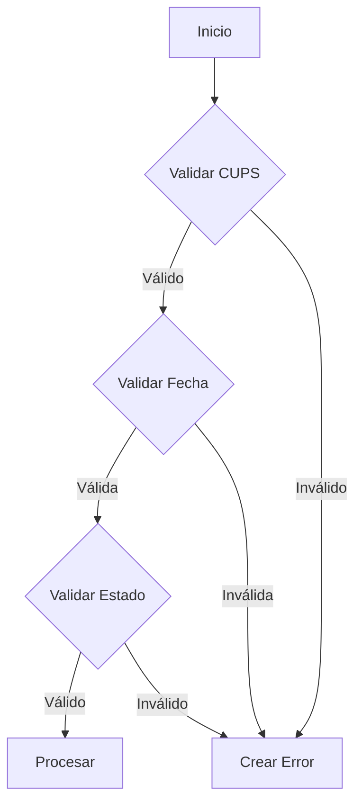
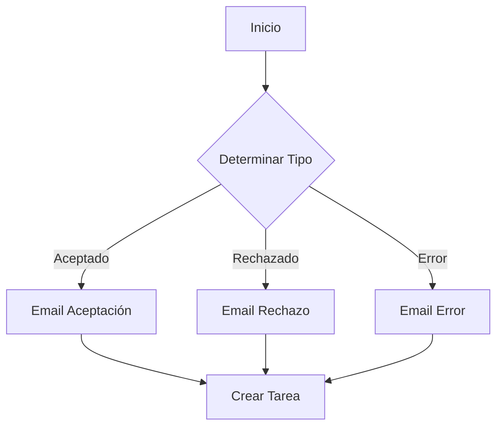

# Manual de Integración de Procesos de Switching de Gas

## 1. Introducción

Este manual describe la integración de procesos de switching de gas con el distribuidor GasAlta. El sistema está diseñado para manejar múltiples tipos de procesos de switching, incluyendo:

- Alta de servicio
- Baja de servicio
- Cambio de comercializadora
- Cambio de titular
- Cambio de comercializadora con cambio de titular 

## 2. Arquitectura del Sistema

### 2.1 Estructura de Clases

El sistema está organizado en una jerarquía de clases que sigue el principio de responsabilidad única:

1. **BaseSwitchingProcess** (Clase Abstracta)
   - Define la interfaz común para todos los procesos
   - Maneja el registro de errores y eventos
   - Proporciona métodos abstractos que deben ser implementados

2. **GasAltaProcess** (Clase Abstracta)
   - Hereda de BaseSwitchingProcess
   - Implementa la lógica común para procesos de GasAlta
   - Maneja el procesamiento de respuestas estándar

3. **Procesos Específicos** (Clases Concretas)
   - GasBajaProcess
   - GasCambioComercializadoraProcess
   - GasCambioTitularProcess
   - GasCambioComercializadoraTitularProcess
   - Cada uno implementa su lógica específica de validación y generación de XML

4. **GasAltaIntegration**
   - Maneja la comunicación con el distribuidor
   - Instancia los procesos específicos según el tipo
   - Gestiona errores de comunicación

### 2.2 Flujo de Procesamiento

1. **Inicio del Proceso**
   - El usuario inicia un proceso específico
   - GasAltaIntegration instancia el proceso correspondiente

2. **Validación**
   - El proceso específico valida los datos requeridos
   - Se generan errores si faltan datos o son inválidos

3. **Generación de XML**
   - El proceso genera el XML específico para el tipo de solicitud
   - Se incluyen todos los datos necesarios según el proceso

4. **Comunicación**
   - GasAltaIntegration envía el XML al distribuidor
   - Maneja la respuesta y posibles errores de comunicación

5. **Procesamiento de Respuesta**
   - El proceso específico procesa la respuesta
   - Actualiza el estado del servicio según el tipo de respuesta
   - Registra eventos y actualiza fechas relevantes 

## 3. Tipos de Procesos

### 3.1 Baja de Gas (GasBajaProcess)

#### 3.1.1 Campos Requeridos
- CUPS (Código Universal del Punto de Suministro)
- Fecha de baja solicitada

#### 3.1.2 Validaciones Específicas
- El servicio debe estar activo
- La fecha de baja debe ser futura
- No debe haber otros procesos pendientes

#### 3.1.3 Estados Posibles
- Aceptado: La baja ha sido aprobada
- Rechazado: La baja ha sido denegada
- Pendiente: En espera de respuesta
- Error: Error en el procesamiento

### 3.2 Cambio de Comercializadora (GasCambioComercializadoraProcess)

#### 3.2.1 Campos Requeridos
- CUPS
- Nueva comercializadora
- Fecha efectiva del cambio

#### 3.2.2 Validaciones Específicas
- El servicio debe estar activo
- La fecha efectiva debe ser futura
- No debe haber otros procesos pendientes

#### 3.2.3 Estados Posibles
- Aceptado: El cambio ha sido aprobado
- Rechazado: El cambio ha sido denegado
- Pendiente: En espera de respuesta
- Activado: El cambio ha sido efectuado
- Error: Error en el procesamiento

### 3.3 Cambio de Titular (GasCambioTitularProcess)

#### 3.3.1 Campos Requeridos
- CUPS
- Nuevo titular (nombre y NIF)
- Fecha efectiva del cambio

#### 3.3.2 Validaciones Específicas
- El servicio debe estar activo
- La fecha efectiva debe ser futura
- No debe haber otros procesos pendientes

#### 3.3.3 Estados Posibles
- Aceptado: El cambio ha sido aprobado
- Rechazado: El cambio ha sido denegado
- Pendiente: En espera de respuesta
- Activado: El cambio ha sido efectuado
- Error: Error en el procesamiento

### 3.4 Cambio de Comercializadora con Cambio de Titular (GasCambioComercializadoraTitularProcess)

#### 3.4.1 Campos Requeridos
- CUPS
- Nueva comercializadora
- Nuevo titular (nombre y NIF)
- Fecha efectiva del cambio

#### 3.4.2 Validaciones Específicas
- El servicio debe estar activo
- La fecha efectiva debe ser futura
- No debe haber otros procesos pendientes

#### 3.4.3 Estados Posibles
- Aceptado: El cambio ha sido aprobado
- Rechazado: El cambio ha sido denegado
- Pendiente: En espera de respuesta
- Activado: El cambio ha sido efectuado
- Error: Error en el procesamiento 

## 4. Implementación de Nuevos Procesos

### 4.1 Estructura de Clases

Para implementar un nuevo proceso de switching, se debe crear una nueva clase que herede de `GasAltaProcess`. La estructura básica es:

```apex
public class NuevoProcesoProcess extends GasAltaProcess {
    private static final String PROCESS_TYPE = 'NUEVO_PROCESO';
    
    public NuevoProcesoProcess(Switching_Message__c message) {
        super(message);
        message.Process_Type__c = PROCESS_TYPE;
    }
    
    public override void validate() {
        // Implementar validaciones específicas
    }
    
    public override String generateXML() {
        // Implementar generación de XML específica
    }
    
    public override void processResponse() {
        // Implementar procesamiento de respuesta específico
    }
}
```

### 4.2 Pasos para Implementar un Nuevo Proceso

1. **Crear la Clase del Proceso**
   - Heredar de `GasAltaProcess`
   - Definir el tipo de proceso
   - Implementar los métodos abstractos

2. **Implementar Validaciones**
   - Definir campos requeridos
   - Implementar reglas de validación
   - Manejar errores específicos

3. **Generar XML**
   - Definir estructura del mensaje
   - Incluir todos los campos necesarios
   - Seguir el formato requerido por el distribuidor

4. **Procesar Respuestas**
   - Manejar todos los tipos de respuesta posibles
   - Actualizar el estado del servicio
   - Registrar eventos relevantes

5. **Actualizar GasAltaIntegration**
   - Añadir el nuevo tipo de proceso al método `getProcessInstance`
   - Probar la integración completa

### 4.3 Buenas Prácticas

1. **Mantenimiento de Código**
   - Reutilizar código común de `GasAltaProcess`
   - Seguir el patrón de diseño establecido
   - Documentar cambios y nuevas funcionalidades

2. **Manejo de Errores**
   - Usar el sistema de registro de errores
   - Proporcionar mensajes claros
   - Mantener traza de errores

3. **Pruebas**
   - Probar todos los escenarios posibles
   - Validar respuestas del distribuidor
   - Verificar actualizaciones de estado 

## 5. Arquitectura Híbrida (Apex + Flows)

### 5.1 Visión General

El sistema utiliza una arquitectura híbrida que combina:
- **Apex**: Para la integración con el distribuidor y lógica compleja
- **Flows**: Para la lógica de negocio dinámica y fácilmente modificable

### 5.2 Componentes del Sistema

#### 5.2.1 Componentes Apex
- **GasAltaIntegration**: Maneja la comunicación con el distribuidor
- **GasAltaProcess**: Procesa las respuestas del distribuidor
- **Procesos Específicos**: Implementan la lógica específica de cada proceso

#### 5.2.2 Flows Implementados

1. **Validación de Datos (GasSwitching_Validation)**
   - Valida campos requeridos
   - Verifica reglas de negocio
   - Crea registros de error si es necesario

2. **Procesamiento de Respuestas (GasSwitching_ResponseProcessing)**
   - Actualiza el estado del servicio
   - Crea registros de evento
   - Envía notificaciones

3. **Notificaciones (GasSwitching_Notifications)**
   - Envía emails a usuarios relevantes
   - Crea tareas de seguimiento
   - Actualiza registros relacionados

### 5.3 Flujo de Procesamiento

1. **Inicio del Proceso**
   - Flow de validación verifica los datos
   - Si es válido, llama a la clase Apex correspondiente

2. **Comunicación con Distribuidor**
   - Apex maneja la generación de XML y comunicación
   - Registra la respuesta del distribuidor

3. **Procesamiento de Respuesta**
   - Apex procesa la respuesta inicial
   - Flow de procesamiento de respuestas maneja las actualizaciones
   - Flow de notificaciones envía alertas

### 5.4 Ventajas de la Arquitectura Híbrida

1. **Flexibilidad**
   - Las reglas de negocio pueden modificarse sin cambios de código
   - Los administradores pueden actualizar flujos según sea necesario

2. **Mantenibilidad**
   - Separación clara de responsabilidades
   - Código Apex más limpio y enfocado

3. **Escalabilidad**
   - Fácil añadir nuevos flujos de proceso
   - Simple modificar comportamientos existentes

### 5.5 Implementación de Nuevos Flows

Para implementar un nuevo Flow:

1. **Crear el Flow**
   - Usar el diseñador de Flow
   - Definir variables de entrada/salida
   - Implementar la lógica de negocio

2. **Integrar con Apex**
   - Definir la interfaz de invocación
   - Manejar errores y excepciones
   - Proporcionar feedback al usuario

3. **Probar el Flow**
   - Validar todos los escenarios
   - Verificar integración con Apex
   - Probar casos de error

### 5.6 Ejemplo de Flow de Validación



### 5.7 Ejemplo de Flow de Notificación

